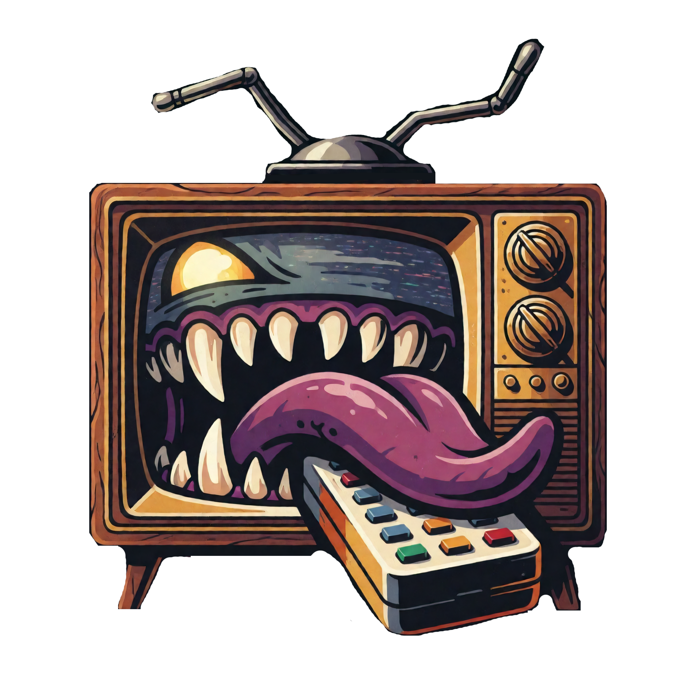

<p align="center"></p>

# mimicTV

> **Early.** It plays real channels through a real ErsatzTV Next, but it is young: expect rough edges and breaking changes to the saved state between versions.

A scheduler and UI for [ErsatzTV Next](https://github.com/ErsatzTV/next). Next transcodes and streams; mimicTV decides what plays when, and makes setting that up pleasant: pick shows, choose a format, watch the day re-flow, and it's on the air.

- **Channels** are built on one screen: shows, a format (half-hour, hour drama, movies, back to back…), and what fills the breaks, with the day's preview alongside.
- **Break points** inside episodes are found by watching the video for the fades to black around commercials, checked per season, and saved without ever touching your files.
- **The Guide** shows every channel as published, with a live marker and an in-app preview of the stream.
- **Publishing** writes ErsatzTV Next's files a few days ahead and keeps them topped up. Editing a channel changes its future from the next break, never what's playing.

## Install

With Docker, next to ErsatzTV Next: see [docs/docker.md](docs/docker.md). In short: set two host paths in `docker-compose.yml`, `docker compose up -d`, open `http://<host>:8787`.

From source: Node 22+ and ffmpeg on PATH, then `npm install && npm run dev` (app on :5173, service on :8787). See [docs/development.md](docs/development.md).

## First run

1. **Setup**: add your media folders (shows, commercials, IDs, bumpers, filler) and scan; set the folder ErsatzTV Next reads from and publish; set ErsatzTV Next's address on your network.
2. **Channels → New channel**: tick some shows. It starts at the current half hour.
3. Restart ErsatzTV Next once (it reads the lineup only at startup), then press ▶ on the Guide or point Plex, Jellyfin, Emby, or an IPTV app at the M3U and XMLTV links in the sidebar.

The Help page in the app walks through the rest: formats, breaks, time bands, fixed shows, mirrors, and what to do when something looks off.

## Media on another machine

If mimicTV can't see the media itself, run the probe on the box that has it (needs `ffprobe`) and send the result to the service:

```sh
./scripts/probe-library.sh -u http://<mimictv-host>:8787/imports/upload /path/to/media/TV /path/to/media/Commercials
```

It reads paths, durations, chapters, and stream facts; nothing else leaves the box. The service builds the library from it on arrival, exactly as a scan would. Paths must be what ErsatzTV Next will see, or add a path mapping in Setup. `-n 50` probes a sample first; `-r` resumes; `-j` gzips.

## How it works

ErsatzTV Next reads a flat, timestamped list of "play this file from here to there" and picks the file whose name covers "now", re-reading on every lookup. mimicTV writes those files atomically, a few days ahead. Each channel has a **checkpoint**: cursor state at a moment plus the rules in force then. Replaying those rules is deterministic, so a republish reproduces what was already written up to the next block boundary, then continues with the current rules. The app previews from the same plan, so the Guide is what Next plays.

Everything is JSON on disk under `data/`: rules, library, break decisions, checkpoints. Small, readable, easy to back up.

Docs: [domain model](docs/domain-model.md) · [break points](docs/breaks.md) · [ErsatzTV Next schema notes](docs/next-schema.md) · [development](docs/development.md).

## License

MIT. See [LICENSE](LICENSE).
