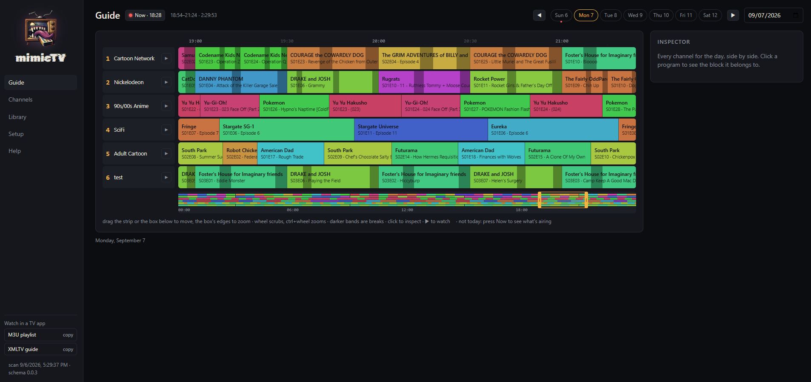

<p align="center"></p>

# mimicTV

> **Early days.** It can output working playouts to ErsatzTV Next, but may have bugs or breaking changes in future.

A scheduler and UI for [ErsatzTV Next](https://github.com/ErsatzTV/next). ErsatzTV Next is a backend transcoder and streamer only, so mimicTV is an attempt at a frontend that is somewhat easy to work inside, while allowing for fine control if desired.

<p align="center"></p>

- **Library**: what you have. Shows, folders, and shared collections.
- **Channels**: what you build. Shows, a format, and what fills the breaks, with the day's preview alongside as you edit.
- **Guide**: what's on. Every channel for the day side by side, a live marker, and a preview of the stream.

## Install

With Docker, next to ErsatzTV Next: see [docs/docker.md](docs/docker.md). In short: set two host paths in `docker-compose.yml`, `docker compose up -d`, open `http://<host>:8787`.

From source: Node 22+ and ffmpeg on PATH, then `npm install && npm run dev` (app on :5173, service on :8787). See [docs/development.md](docs/development.md).

## First run

1. **Setup**: add your media folders (shows, commercials, IDs, bumpers, filler) and scan; set the folder ErsatzTV Next reads from and publish; set ErsatzTV Next's address on your network.
2. **Channels → New channel**: tick some shows. It starts at the current half hour.
3. Restart ErsatzTV Next once (it reads the lineup only at startup), then press ▶ on the Guide or point Plex, Jellyfin, Emby, or an IPTV app at the M3U and XMLTV links in the sidebar.

The Help page in the app walks through the rest: formats, breaks, time bands, fixed shows, mirrors, and what to do when something looks off.

## How it works

ErsatzTV Next reads a flat, timestamped list of "play this file from here to there" and picks the file whose name covers "now", re-reading on every lookup. mimicTV writes those files atomically, a few days ahead. Each channel has a **checkpoint**: cursor state at a moment plus the rules in force then. Replaying those rules is deterministic, so a republish reproduces what was already written up to the next block boundary, then continues with the current rules. The app previews from the same plan, so the Guide is what Next plays.

Everything is JSON on disk under `data/`: rules, library, break decisions, checkpoints. Small, readable, easy to back up.

Docs: [domain model](docs/domain-model.md) · [break points](docs/breaks.md) · [ErsatzTV Next schema notes](docs/next-schema.md) · [development](docs/development.md).

## Advanced tools

**Break points.** Ad breaks inside an episode need a point where the show fades out. Chapters that came with a file are usually scene marks, not breaks, so mimicTV can find them itself: open a show's Breaks page, press Analyze, and it watches each episode for the fades to black around commercials and lines them up across the season. Check the picks, nudge any it got wrong, and save. Your video files are never written to. Details in [docs/breaks.md](docs/breaks.md).

**Media on another machine.** If mimicTV can't see the media itself, run the probe on the box that has it (needs `ffprobe`) and send the result to the service:

```sh
./scripts/probe-library.sh -u http://<mimictv-host>:8787/imports/upload /path/to/media/TV /path/to/media/Commercials
```

It reads paths, durations, chapters, and stream facts; nothing else leaves the box. The service builds the library from it on arrival, exactly as a scan would. Paths must be what ErsatzTV Next will see, or add a path mapping in Setup. `-n 50` probes a sample first; `-r` resumes; `-j` gzips.

## License

MIT. See [LICENSE](LICENSE).
